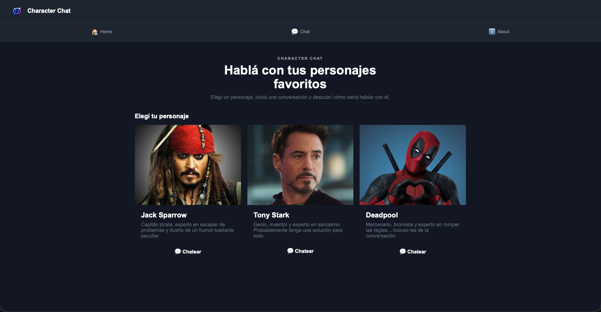
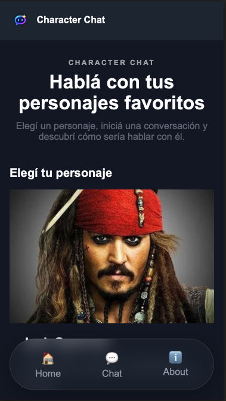
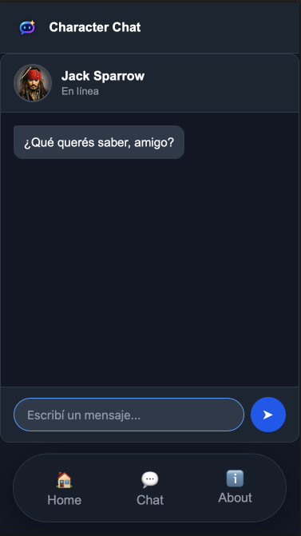

# Character Chat 🎭

Aplicación web que permite conversar con personajes ficticios utilizando inteligencia artificial.

## 🎭 Personajes

La aplicación permite elegir entre:

- 🏴‍☠️ Jack Sparrow
- 🤖 Tony Stark
- 🗡️ Deadpool

Cada personaje tiene una personalidad y forma de responder definida mediante un prompt.

## 🤖 Uso de IA

La aplicación utiliza **Gemini API** para generar las respuestas de los personajes.

El personaje seleccionado determina el prompt utilizado para mantener su personalidad durante la conversación.

## ▶️ Ejecutar el proyecto

Clonar el repositorio:

```bash
git clone https://github.com/octaviolanne-hue/ProyectoIntegradorM3.git
cd ProyectoIntegradorM3
npm install
vercel dev
```

Configurar la variable de entorno necesaria:

```env
GEMINI_API_KEY=tu_api_key
```

Ejecutar:

```bash
vercel dev
```

## 🧪 Tests

Para ejecutar los tests:

```bash
npm test
```

## 🌐 Aplicación desplegada

[Character Chat](https://character-chat-sepia.vercel.app)

## 📸 Capturas







## 📝 Registro de uso de IA

Se utilizó inteligencia artificial como herramienta de asistencia durante el desarrollo del proyecto, principalmente para resolver dudas, revisar código, mejorar prompts y detectar errores.
